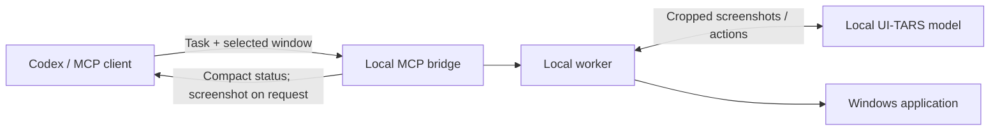

# UI-TARS Local Control

[](https://github.com/basel5099/ui-tars-local-control/actions/workflows/checks.yml)

A Windows MCP bridge and Codex skill that let a supervising assistant delegate a bounded GUI task to a **local UI-TARS 1.5 model**. The local worker handles repeated screenshots and mouse/keyboard actions, then returns a compact result for verification.

This can reduce the screenshots and action history sent to a cloud assistant. The supervising assistant still uses tokens for planning, tool calls, and verification; no fixed savings are promised.



## What is included

- A discoverable [Codex skill](skill/SKILL.md), with a CLI fallback.
- Six MCP tools: health, window selection, task start, status, stop, and screenshot retrieval.
- One worker at a time, bounded actions and runtime, duplicate-start suppression, and an **F8 emergency stop**.
- Target-window screenshots and focus/process/geometry checks before input.
- Local job records and a final screenshot for independent verification.

This is an independent project built using the [UI-TARS SDK](https://github.com/bytedance/UI-TARS-desktop). It is not an official ByteDance or OpenAI integration. It runs its own task loop; jobs do not appear in UI-TARS Desktop history.

## Requirements

- Windows with an unlocked interactive desktop. Development was tested on Windows 11 x64.
- Node.js 22 or newer, npm, and Git.
- Codex CLI on `PATH` for automatic MCP registration, or another local client supporting MCP over stdio.
- About 9 GB free for the bundled model setup, plus RAM/VRAM for inference. CUDA mode was tested on a 12 GB NVIDIA GPU; 16 GB or more system RAM is a practical starting point. CPU mode is available but much slower and has not been performance-tested here.

Choose `-WithModel` for a complete setup, or connect an already running UI-TARS 1.5 OpenAI-compatible vision endpoint. The default endpoint is `http://127.0.0.1:8080/v1` with model ID `ui-tars-1.5-7b`. UI-TARS Desktop is optional.

## Install

In PowerShell:

```powershell
git clone https://github.com/basel5099/ui-tars-local-control.git
cd ui-tars-local-control
powershell -NoProfile -ExecutionPolicy Bypass -File .\install.ps1 -WithModel
```

This downloads UI-TARS 1.5 7B **Q4_K_M**, its matching **vision projector**, and a pinned **llama.cpp** runtime from the original hosts. Downloads resume after interruption and every file is checked against a pinned SHA-256. Setup selects CUDA for detected NVIDIA graphics, otherwise CPU, starts the loopback server, and connects the bridge. Model files total 6.13 GB; the CUDA archives add about 657 MB. [Full model setup and troubleshooting](docs/model-setup.md).

To keep large files on another drive:

```powershell
.\install.ps1 -WithModel -InstallDirectory 'D:\Apps\UI-TARS-Control' -ModelRoot 'D:\Models\UI-TARS'
```

If your model is already running, omit `-WithModel` to install only the bridge and skill.

Defaults:

| Component | Location |
| --- | --- |
| Bridge | `%LOCALAPPDATA%\UI-TARS-Local-Control` |
| Skill | `%CODEX_HOME%\skills\ui-tars-local-control`, or `%USERPROFILE%\.codex\skills\ui-tars-local-control` |
| Model settings | `control.config.json` inside the bridge directory |
| Local jobs | `data\jobs` inside the bridge directory |

The installer runs unit and MCP protocol checks, then registers the stdio server as `ui_tars_local_control`. Reopen the chat or restart Codex if the new tools are not yet available.

For a different endpoint, model ID, or installation directory:

```powershell
.\install.ps1 -InstallDirectory 'D:\Apps\UI-TARS-Control' -ModelBaseUrl 'http://127.0.0.1:8081/v1' -ModelName 'my-ui-tars-model'
```

Use `-SkillDirectory` to choose another skill location. Use `-SkipMcpRegistration` when using a different MCP client; configure that client to launch `node` with the absolute path to `src/server.mjs` inside the installed bridge directory. The server uses stdio and does not expose an HTTP control port. A hosted chat cannot access this local stdio server automatically.

### Model setup

To check hardware and disk space without downloading anything, then install just the model:

```powershell
.\setup-model.ps1 -ModelRoot 'D:\Models\UI-TARS' -CheckOnly
.\setup-model.ps1 -ModelRoot 'D:\Models\UI-TARS' -Start
```

Use `-Backend cuda` or `-Backend cpu` to override detection, `-Port` for a different model port, and `-ModelDirectory` to reuse existing files with the exact names in [the manifest](model/manifest.json). Existing files are verified before reuse. The all-in-one installer uses `-ModelPort` for the corresponding port option.

For an already downloaded model and matching projector, manual [llama.cpp](https://github.com/ggml-org/llama.cpp) startup is also possible:

```powershell
& 'C:\path\to\llama-server.exe' -m 'C:\models\ui-tars-1.5-7b-q4_k_m.gguf' --mmproj 'C:\models\ui-tars-1.5-7b-mmproj-f16.gguf' --alias ui-tars-1.5-7b --host 127.0.0.1 --port 8080 -ngl all -c 32768 -np 1
```

Replace the paths with actual files and adjust GPU/context settings for your machine. Use the model publisher's matching model/projector files and check their license. Confirm that `GET /v1/models` lists the configured model ID. Model weights and third-party binaries are not distributed here.

Optional automatic startup: supply `-ModelLauncher 'C:\path\to\Start-Model.ps1'` when installing. The script must accept `param([switch]$ModelOnly)`, start only the local model when that flag is present, wait until the endpoint is ready, and then return. The bridge invokes it without a visible PowerShell window if the model is unavailable. Without a launcher, start the model yourself before running a task.

## Use from Codex

Example prompt:

> Use $ui-tars-local-control to type "LOCAL CONTROL OK" in the open test application, click Confirm, and verify the displayed result.

The skill selects a visible window, submits a bounded task, waits for compact status, and verifies the outcome. Keep the target fully on the primary display and avoid interacting with the desktop during execution. **Press F8 to stop.** Changing focus also stops subsequent input.

| MCP tool | Purpose |
| --- | --- |
| `health` | Check the endpoint, active job, and data location |
| `list_windows` | Get visible window IDs and availability |
| `run_task` | Start one task in a selected window |
| `get_status` | Read compact progress, optionally waiting up to 20 seconds |
| `stop_task` | Request cancellation; poll status to confirm it stopped |
| `get_screenshot` | Retrieve the latest cropped screenshot on demand |

Task example; replace `window_id` with a value returned by `list_windows`:

```json
{
  "task": "Type LOCAL CONTROL OK in the input, click Confirm, and finish when the label reads Confirmed: LOCAL CONTROL OK.",
  "window_id": 123456,
  "max_steps": 15,
  "timeout_seconds": 180,
  "request_id": "local-test-001"
}
```

Defaults are 15 actions and 180 seconds, with hard maxima of 60 actions and 600 seconds. Reuse `request_id` only to recover the outcome of the same start request. A fresh task needs a fresh ID.

`completed` means the local model reported completion. `verified: false` is intentional: the supervisor must check the actual file, application state, or final screenshot. Failed tasks are not automatically replayed. Workers continue if the MCP client disconnects; use `stop_task` or F8 to cancel them.

### CLI

```powershell
$bridge = Join-Path $env:LOCALAPPDATA 'UI-TARS-Local-Control'
node "$bridge\src\cli.mjs" health
node "$bridge\src\cli.mjs" windows 'Notepad'
node "$bridge\src\cli.mjs" start --file 'C:\path\to\request.json'
node "$bridge\src\cli.mjs" status JOB_ID 20
node "$bridge\src\cli.mjs" screenshot JOB_ID
node "$bridge\src\cli.mjs" stop JOB_ID
```

The screenshot command returns a local filename. The installed skill also includes `scripts/control.ps1`, which resolves the bridge location from its local `runtime.json` or `UI_TARS_CONTROL_HOME`.

## Desktop test and token comparison

A disposable Windows form was controlled by the supervising assistant and by local UI-TARS. Both typed the same phrase and clicked Confirm; the saved output was checked independently. The direct run sent four screenshots to the cloud chat. Local delegation used file verification and sent none during the runner.

The first successful local run used **6,410 local tokens** (6,107 input + 303 output), **4 model calls**, and **3 actions**. Cloud billed-token totals are unavailable, so the report keeps them unknown. It includes a separately labelled GPT-4.1 image-token reference calculation rather than claiming a total-token or cost reduction.

See the [measured results, limitations, and reproduction steps](bench/README.md). This is a small synthetic test, not a general performance ranking.

## Configuration

Edit the installed `control.config.json`, or set environment variables in the process launching the MCP server. Restart the MCP server after changes. Environment variables take precedence.

| JSON key | Environment variable | Default |
| --- | --- | --- |
| `base_url` | `UI_TARS_BASE_URL` | `http://127.0.0.1:8080/v1` |
| `model` | `UI_TARS_MODEL` | `ui-tars-1.5-7b` |
| `launcher` | `UI_TARS_LAUNCHER` | None |
| `data_directory` | `UI_TARS_CONTROL_DATA` | `<bridge>/data` |

`UI_TARS_CONFIG` selects an alternative config file. The bridge accepts only loopback model URLs and refuses redirects. Its API key is the literal placeholder `local`; authenticated model endpoints are not currently supported. Reinstalling preserves saved settings unless a corresponding installer argument is supplied.

## Boundaries and local data

The worker supports ordinary clicks, typing, hotkeys, scrolling, and waits. Dragging, secondary-display workflows, and automatic switching to new modal windows are not supported. It blocks known terminal, supervisor, and authentication apps and selected system shortcuts. Focus and window geometry changes stop subsequent input; an input operation already in progress may finish.

These checks and the local model's prompt are **not a security sandbox**. Use bounded tasks in trusted applications. The prompt requests a handoff for credentials, external messages/submissions/uploads, deletion, purchases, and security changes; it cannot guarantee semantic enforcement. A selected browser or document can still display untrusted instructions. Do not run this worker concurrently with another desktop controller, including UI-TARS Desktop.

Screenshots and model action loops go to the configured loopback model server. Job tasks, window titles, typed text, predictions, logs, and the latest screenshot are stored locally in `data/jobs`; retention is manual. Compact statuses go back to the supervising client, and requesting `get_screenshot` sends that image to the client too. Review these files before sharing diagnostics. Keep model-server ports bound to loopback. The repository excludes runtime configuration, jobs, screenshots, logs, dependencies, and model files.

## Development and checks

```powershell
npm ci
npm test
npm run test:mcp
```

Unit and protocol checks do not require a model or control the desktop. GitHub Actions also tests a fresh installation and the installed CLI helper on Windows. Live GUI checks require an unlocked desktop and running model; see [test/README.md](test/README.md).

Dependency status at publication: `npm audit` reports a moderate [file-type parser advisory](https://github.com/advisories/GHSA-5v7r-6r5c-r473) inherited through Jimp and UI-TARS dependencies. The vulnerable parser handles malformed ASF files; this bridge supplies captured PNG screenshots, but the dependency advisory remains unresolved. Review `npm audit` when updating; avoid forcing incompatible major versions into the pinned SDK dependencies.

## License

[ISC](LICENSE) for this project's code. Third-party SDKs, binaries, and model weights retain their own licenses.
